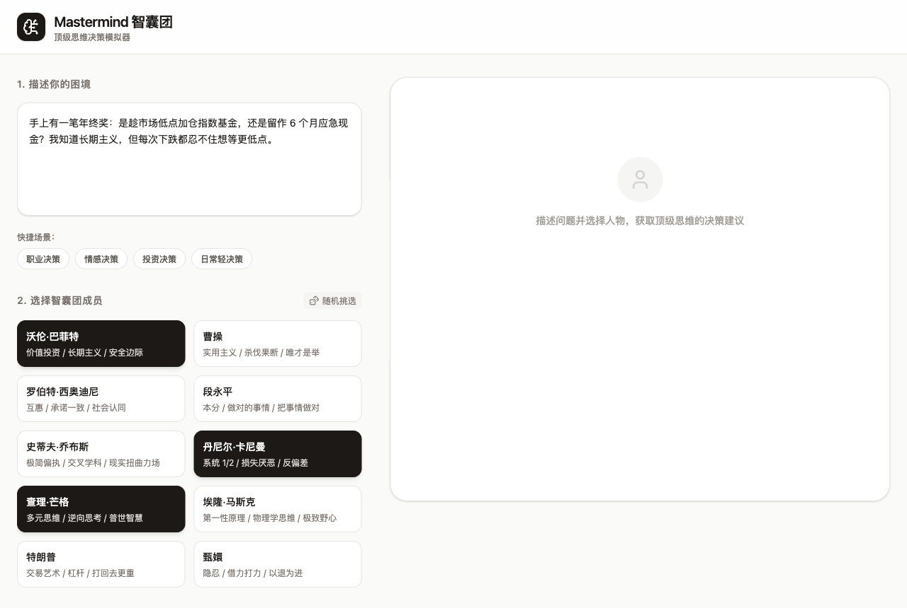
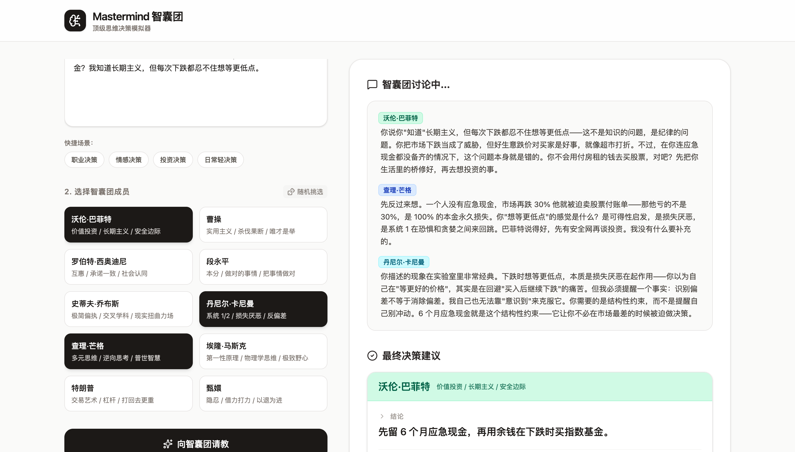
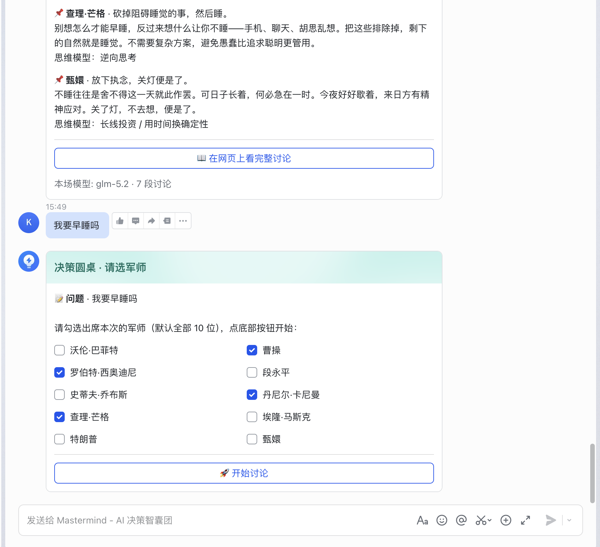
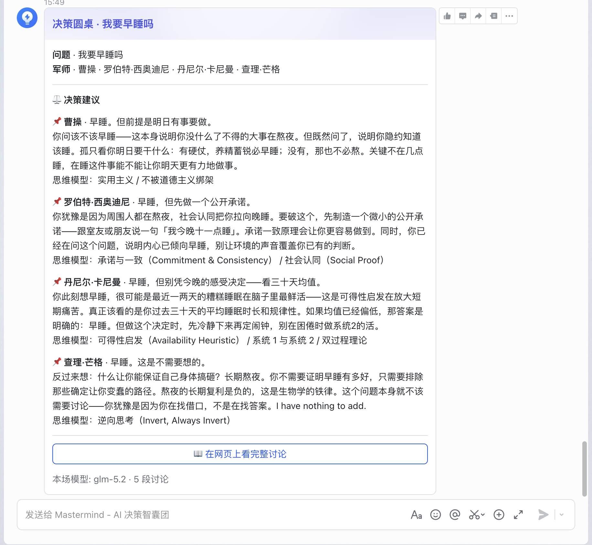

# Mastermind 智囊团 — 让 10 位大师"吵"完，你再做决定

> 给读过很多思维模型、却难在真实决策中用上它们的人的 AI 决策参谋——一份会自己运转的芒格式决策清单。

网页版：[mastermind-gamma-weld.vercel.app](https://mastermind-gamma-weld.vercel.app) · 飞书 DM 机器人：私聊提问 → 勾选军师 → 卡片流式出结果

## 为什么做这个

这段时间读书攒下了不少思维模型——芒格的多元思维、卡尼曼的系统 1/2、西奥迪尼的影响力……我很想在每一次决策里都理性地用上它们。但思维模型不是看过就能调用的：它需要反复实践，才能内化成系统一的直觉——在那之前，真实决策时刻最先接管的仍是直觉和认知偏差。芒格给过解法：每个人都该有一套自己的**决策清单**，做任何决策前强迫自己过一遍，用流程调用系统二、压住系统一的偏差。Mastermind 就是这份决策清单的自动化版本：把 10 位人物各自的思维模型写成结构化人设（芒格、卡尼曼、西奥迪尼正是那些书的作者本人），让他们在圆桌上就你的问题相互讨论，每人给出一张带立场的决策卡——你拿到的不是"标准答案"，是被 10 套思维模型各拆了一遍的问题。还有一层副作用同样重要：每张决策卡都标注了用了哪个模型、怎么用的，看他们对一个具体问题的拆解过程，本身就是对思维模型最好的复习——用得越多，内化越深，直到有一天成为你的直觉。

## 核心功能

- ✅ 一次提问看完整场讨论 —— 描述困境 → 选军师 → 讨论逐字流式输出，军师之间互相 @、相互讨论，不是各说各话
- ✅ 每人一张决策卡 —— 立场结论 + 依据 + 标注用了哪些思维模型（「安全边际」还是「第一性原理」），推理来源可追溯
- ✅ 结构化军师库 —— 每位军师一个 `SKILL.md`（心智模型 / 代表语录 / 自觉边界 / 说话风格四段），加一个目录即可新增军师，构建期编译进产物
- ✅ 结果一键分享 —— 生成 `/?c=<id>` 链接，服务端直出 HTML（~250ms 可读，不等 React 水合）
- ✅ 飞书 DM 入口 —— 私聊即用：选人卡片 → 流式"讨论中"卡片 → 决策卡按钮跳回完整讨论页
- ✅ LLM 配额自愈链 —— 主模型 429/超时自动切备用模型，当日耗尽记忆到零点重置，5xx 指数退避重试

## 10 位军师

| 领域 | 军师 | 标签 |
|---|---|---|
| 投资 / 战略 | 沃伦·巴菲特 `buffett` | 价值投资 / 长期主义 / 安全边际 |
| | 查理·芒格 `munger` | 多元思维 / 逆向思考 / 普世智慧 |
| | 段永平 `duanyongping` | 本分 / 做对的事情 / 把事情做对 |
| 创业 / 产品 | 埃隆·马斯克 `musk` | 第一性原理 / 物理学思维 / 极致野心 |
| | 史蒂夫·乔布斯 `jobs` | 极简偏执 / 交叉学科 / 现实扭曲力场 |
| 心理 / 影响力 | 罗伯特·西奥迪尼 `cialdini` | 互惠 / 承诺一致 / 社会认同 |
| | 丹尼尔·卡尼曼 `kahneman` | 系统 1/2 / 损失厌恶 / 反偏差 |
| 政治 / 谈判 | 曹操 `caocao` | 实用主义 / 杀伐果断 / 唯才是举 |
| | 特朗普 `trump` | 交易艺术 / 杠杆 / 打回去更重 |
| 文学 / 虚构 | 甄嬛 `zhenhuan` | 隐忍 / 借力打力 / 以退为进 |

每位军师的 vault 含 6-7 个心智模型、5-7 句代表语录、5-6 条自觉边界、8-10 条说话风格。想扩充阵容：在 `advisors/` 下新建 `<id>/SKILL.md`（M/Q/B/S 四段 + frontmatter），构建时自动编译进产物，无需改代码。

## 效果展示



一场真实圆桌（2026-07-24 实录）——巴菲特/芒格/卡尼曼辩论「年终奖加仓还是留现金」，随后每人一张决策卡：



**飞书 DM 入口** —— 私聊提问 → 卡片勾选军师 → 决策建议卡，按钮跳回网页完整讨论：

| 选人卡 | 决策卡 |
|---|---|
|  |  |

在线体验：[mastermind-gamma-weld.vercel.app](https://mastermind-gamma-weld.vercel.app)

## 快速开始

```bash
npm install
cp .env.example .env.local   # 填 DASHSCOPE_API_KEY（阿里云百炼）
npm run dev                  # http://localhost:3000
```

| 环境变量 | 必需 | 用途 |
|---|---|---|
| `DASHSCOPE_API_KEY` | 是 | 阿里云百炼（DashScope）key，OpenAI 兼容端点调 Qwen 系模型 |
| `LLM_MODEL_CHAIN` | 否 | 逗号分隔的备用模型链，配额耗尽/超时自动切换 |
| `KV_REST_API_URL` / `KV_REST_API_TOKEN` | 分享页需要 | Upstash Redis，存分享 blob（Vercel 集成自动注入） |
| `FEISHU_APP_ID` / `FEISHU_APP_SECRET` | 飞书需要 | 自建应用凭证，`npm start` 起长连接 worker |

全部变量说明见 [.env.example](.env.example)。测试：`npm test`（111 个单测 + 集成）。

## 技术方案（简）

React 19 + Vite + Tailwind 4；Vercel Edge Functions 做 SSE 流式输出（LLM 端点钉 `sfo1`——2026-07 实测 hkg1→DashScope 跨境链路挂起后迁移）；分享数据存 Upstash Redis。数据流：前端把问题 + 选中军师 POST 到 edge → 单次 LLM 调用让模型分饰多角，输出 `<discussion>` 讨论块 + `<conclusions>` JSON → 客户端增量解析渲染。飞书侧一个 WSClient 长连接 worker 复用同一条 council 链路。

## 设计取舍

1. 在「每位军师独立调用 N 次」和「单次调用分饰多角」之间选了后者：一次响应里军师才能真正互相接话、反驳，延迟和 token 成本也除以 N；代价是人设区分度完全依赖 SKILL.md 的刻画质量（`MODEL_ADVISOR` 变量仍预留着独立调用模式的回头路）。
2. 飞书接入从 webhook 换成长连接 worker（`601fd56`）：此前为凑飞书 3 秒 ack 红线做了 lazy-import、cron 保温（`097feb6`、`028ad4a`）仍扛不住 Vercel 冷启动；代价是要自己养一个常驻进程，为此加了三层 WS watchdog（`97a4196`），静默断连自动退出交给 supervisor 拉起。
3. 分享页 SSR 从根 middleware 迁到 `api/share-ssr.ts`（`918be27` → `333f015` → `1c7d015`）：实测 Vite builder 不识别根 `middleware.ts`，改用 `vercel.json` routes 优先级路由；代价是仓库里留了一块标注 DEPRECATED 的历史现场。

## Roadmap

- [ ] 启用主持人追问（`intake-clarify` 已实现未接线）：问题描述太模糊时先反问澄清，再开圆桌
- [ ] 军师人设独立调用模式：用成本换更强的人设隔离度
- [ ] 飞书 worker 常驻托管（现 GH Actions 每 6h 轮换有 3-5 分钟断连窗口）

## License

MIT
